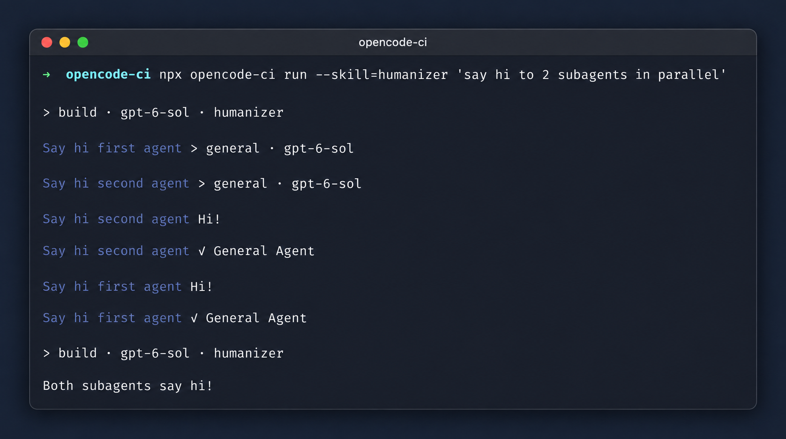

# OpenCode CI

- Subagent output: see child agents' steps and replies in the log.
- `/commands`: run a project command from the prompt.
- `@skills`: the intended skill-mention syntax (currently unreliable in CI; use `--skill` for required skills).
- Account auth (`~/opencode-ci.auth.json`): an alternative when you can't use an API key.

## Subagent output

```sh
npx opencode-ci run --skill=humanizer 'say hi to 2 subagents in parallel'
```

`opencode run` shows a subagent call but not the child's transcript. This client prints the child's steps and replies, with a dim-colored name in terminals and GitHub Actions:



Child output streams as it arrives, even when subagents overlap. If the event stream misses a message, the client prints the saved message before that subagent's completion line.

## `/command`

Run a command defined in your OpenCode project:

```sh
npx opencode-ci run '/review the changed tests'
```

## `@skills`

The intended interface is to mention an installed skill in the prompt, such as [`review-pr`](https://github.com/dbpolito/skills/tree/main/skills/review-pr) from [dbpolito/skills](https://github.com/dbpolito/skills):

```sh
npx skills add dbpolito/skills --skill review-pr -g -a opencode
# Currently not reliable in CI:
# bunx opencode-ci run --auto 'Use @review-pr to review and publish findings for PR #123 in owner/repo'
```

OpenCode's skill catalog can be empty before plugin activation, leaving `@review-pr` as plain text. See [issue #51680](https://github.com/anomalyco/opencode/issues/51680) and [PR #50430](https://github.com/anomalyco/opencode/pull/50430). `@skill:review-pr` has the same limitation.

## Required skills in CI

Require the skill instead of relying on a mention. Repeat `--skill` to attach more than one:

```sh
bunx opencode-ci run --auto --skill=review-pr 'Review and publish findings for PR #123 in owner/repo'
bunx opencode-ci run --skill=review-pr --skill=security 'Review this PR'
```

Required skills are attached directly, without a preliminary skill-list lookup. If any is unavailable, OpenCode rejects the prompt instead of running without it. `--skill` cannot be combined with a `/command` prompt; `@` mentions remain best-effort.

The `review-pr` skill requires `git`, authenticated `gh`, `jq`, the PR head checked out, and enough history to find its merge base; publishing requires PR review permissions.

## OAuth credentials (advanced)

Prefer a provider API key for automation; see the [GitHub Actions example](#api-key). For account auth, the client reads `~/opencode-ci.auth.json` and saves refreshed tokens to the same file:

```sh
npx opencode-ci run --model openai/gpt-6-luna 'Review this repository'
```

See [how to export your login](#use-your-opencode-login-in-ci) and [use it in GitHub Actions](#github-actions-with-oauth-on-ephemeral-runners). Treat this file like a password: never commit it, log it, or upload it as a build artifact.

## GitHub Actions

### API key

Set `OPENAI_API_KEY` as a repository secret and `OPENCODE_MODEL` as a repository variable (or use your provider's equivalents). This is the API-key version of the reviewed [PR review workflow in dbpolito/skills](https://github.com/dbpolito/skills/blob/main/examples/opencode-review-pr.yml):

```yaml
name: opencode-review-pr

on:
  pull_request:
    types: [opened, synchronize, reopened, ready_for_review]

permissions:
  contents: read
  pull-requests: write

jobs:
  review:
    if: github.event.pull_request.draft == false && github.event.pull_request.head.repo.full_name == github.repository
    runs-on: ubuntu-latest
    timeout-minutes: 55
    concurrency:
      group: opencode-review-pr-${{ github.event.pull_request.number }}
      cancel-in-progress: false
    env:
      GH_TOKEN: ${{ github.token }}
      PR_NUMBER: ${{ github.event.pull_request.number }}
      BASE_SHA: ${{ github.event.pull_request.base.sha }}
      HEAD_SHA: ${{ github.event.pull_request.head.sha }}
      REVIEW_LOGIN: github-actions[bot]
      REVIEW_MODEL: ${{ vars.OPENCODE_MODEL }}
      REVIEW_AGENT: build
    steps:
      - uses: actions/checkout@v4
        with:
          ref: ${{ github.event.pull_request.head.sha }}
          fetch-depth: 0
          persist-credentials: false

      - uses: actions/setup-node@v4
        with:
          node-version: '24'

      - name: Install review skill
        run: npx --yes skills add dbpolito/skills --skill review-pr -g -a opencode -y

      - name: Review
        env:
          OPENAI_API_KEY: ${{ secrets.OPENAI_API_KEY }}
        run: |
          npx --yes opencode-ci@latest run --auto --thinking \
            --agent "$REVIEW_AGENT" --model "$REVIEW_MODEL" --timeout 2700 \
            --title "review-pr $GITHUB_RUN_ID/$GITHUB_RUN_ATTEMPT" \
            --skill=review-pr \
            'Review and publish findings for the PR supplied in the environment.'
```

The workflow uses the latest published `opencode-ci`, including `--skill` support.

The [`review-pr` skill](https://github.com/dbpolito/skills/tree/main/skills/review-pr) publishes a GitHub review. To allow the bot to approve PRs, enable that option in the repository's Actions settings.

## Use your OpenCode login in CI

Prefer an API key when possible. If you use your OpenCode login instead, give CI its own credential so local and CI runs don't rotate the same refresh token.

1. Log in with the OpenCode CLI or desktop app. For ChatGPT Plus/Pro, choose OpenAI's ChatGPT OAuth method.
2. Export the saved login:

   ```sh
    npx --yes opencode-ci@latest auth export \
     --db "$(opencode debug paths db)" \
     --integration openai
   ```

   This writes `~/opencode-ci.auth.json` with owner-only permissions (0600). Use `--output PATH` for another location.

3. Upload it as a GitHub Actions secret named `OPENCODE_CI_AUTH_JSON`:

   ```sh
   gh secret set OPENCODE_CI_AUTH_JSON < "$HOME/opencode-ci.auth.json"
   ```

   Do not commit or print the file.
4. Log out and log in again locally to get a new credential for local use. CI keeps the credential you exported in step 2. Re-export only if you need to reseed CI (for example, after the refresh token is revoked or expires).

### GitHub Actions with OAuth on ephemeral runners

Set `OPENCODE_MODEL` as a repository variable and add `PAT_TOKEN` as a secret with permission to update Actions secrets (`GITHUB_TOKEN` cannot). This follows the auth variant of the [PR review workflow in dbpolito/skills](https://github.com/dbpolito/skills/blob/main/examples/opencode-review-pr.yml):

```yaml
name: opencode-review-pr

on:
  pull_request:
    types: [opened, synchronize, reopened, ready_for_review]

permissions:
  contents: read
  pull-requests: write

jobs:
  review:
    if: github.event.pull_request.draft == false && github.event.pull_request.head.repo.full_name == github.repository
    runs-on: ubuntu-latest
    timeout-minutes: 55
    concurrency:
      group: opencode-review-pr-${{ github.event.pull_request.number }}
      cancel-in-progress: false
    env:
      GH_TOKEN: ${{ github.token }}
      PR_NUMBER: ${{ github.event.pull_request.number }}
      BASE_SHA: ${{ github.event.pull_request.base.sha }}
      HEAD_SHA: ${{ github.event.pull_request.head.sha }}
      REVIEW_LOGIN: github-actions[bot]
      REVIEW_MODEL: ${{ vars.OPENCODE_MODEL }}
      REVIEW_AGENT: build
    steps:
      - uses: actions/checkout@v4
        with:
          ref: ${{ github.event.pull_request.head.sha }}
          fetch-depth: 0
          persist-credentials: false

      - uses: actions/setup-node@v4
        with:
          node-version: '24'

      - name: Install review skill
        run: npx --yes skills add dbpolito/skills --skill review-pr -g -a opencode -y

      - name: Load auth credentials
        id: auth
        env:
          OPENCODE_CI_AUTH_JSON: ${{ secrets.OPENCODE_CI_AUTH_JSON }}
        run: printf '%s' "$OPENCODE_CI_AUTH_JSON" > "$HOME/opencode-ci.auth.json"

      - name: Review
        run: |
          npx --yes opencode-ci@latest run --auto --thinking \
            --agent "$REVIEW_AGENT" --model "$REVIEW_MODEL" --timeout 2700 \
            --title "review-pr $GITHUB_RUN_ID/$GITHUB_RUN_ATTEMPT" \
            --skill=review-pr \
            'Review and publish findings for the PR supplied in the environment.'

      - name: Save refreshed auth credentials
        if: always() && steps.auth.outcome == 'success'
        env:
          GH_TOKEN: ${{ secrets.PAT_TOKEN }}
          OPENCODE_CI_AUTH_JSON: ${{ secrets.OPENCODE_CI_AUTH_JSON }}
        run: |
          if ! cmp -s "$HOME/opencode-ci.auth.json" <(printf '%s' "$OPENCODE_CI_AUTH_JSON"); then
            gh secret set OPENCODE_CI_AUTH_JSON --repo "$GITHUB_REPOSITORY" < "$HOME/opencode-ci.auth.json"
          fi
```

Only expose account credentials to code and PR authors you trust.

Each run uses a fresh OpenCode database and updates `~/opencode-ci.auth.json` only when credentials change, including after a failed session if cleanup completes. For another file, use both `--auth-file PATH` and `--auth-output PATH`.

Do not cache, log, or upload the credential file. A failed refresh or interrupted write-back may require a fresh login and reseed.

If review jobs may be idle, use the reviewed [auth keepalive workflow in dbpolito/skills](https://github.com/dbpolito/skills/blob/main/examples/opencode-auth.yml) with the same `OPENCODE_MODEL` repository variable:

```yaml
name: opencode-auth

on:
  schedule:
    - cron: '0 9 * * *' # Daily at 09:00 UTC.
  workflow_dispatch:

permissions:
  contents: read

concurrency:
  group: opencode-auth
  cancel-in-progress: false

jobs:
  refresh:
    runs-on: ubuntu-latest
    timeout-minutes: 10
    steps:
      - uses: actions/setup-node@v4
        with:
          node-version: '24'

      - name: Load auth credentials
        id: auth
        env:
          OPENCODE_CI_AUTH_JSON: ${{ secrets.OPENCODE_CI_AUTH_JSON }}
        run: printf '%s' "$OPENCODE_CI_AUTH_JSON" > "$HOME/opencode-ci.auth.json"

      - name: Refresh auth
        env:
          OPENCODE_MODEL: ${{ vars.OPENCODE_MODEL }}
        run: |
          npx --yes opencode-ci@latest run --model "$OPENCODE_MODEL" --timeout 120 \
            'Reply only OK. Do not use tools.'

      - name: Save refreshed auth credentials
        if: always() && steps.auth.outcome == 'success'
        env:
          GH_TOKEN: ${{ secrets.PAT_TOKEN }}
          OPENCODE_CI_AUTH_JSON: ${{ secrets.OPENCODE_CI_AUTH_JSON }}
        run: |
          if ! cmp -s "$HOME/opencode-ci.auth.json" <(printf '%s' "$OPENCODE_CI_AUTH_JSON"); then
            gh secret set OPENCODE_CI_AUTH_JSON --repo "$GITHUB_REPOSITORY" < "$HOME/opencode-ci.auth.json"
          fi
```

The model request makes OpenCode check and refresh an expiring access token; copying the secret without a request does not. `opencode-ci` leaves the file untouched when credentials haven't changed, so the save step skips unnecessary secret updates. The per-PR review group and keepalive group do **not** serialize access to the same credential across runs; concurrent refreshes can race. Use separate credentials or a shared concurrency group if you need to prevent that race. Monitor failures and reseed when needed. Codex's weekly cadence is not an OpenCode guarantee.

### Persistent self-hosted runner

On a trusted **persistent** runner with a private home directory, you can seed `~/opencode-ci.auth.json` from the secret **only if the file is missing**, with mode `0600`, and let later jobs reuse the file. Do not overwrite it from the original secret on every run: that discards refreshed tokens. Keep the runner dedicated or serialize every job sharing that file, and back up or reseed it if refresh stops working. An ephemeral runner needs the secret round-trip above; a persistent directory or Actions cache is not a substitute for a protected credential store on untrusted infrastructure.

## Command options

The CLI has `run`, `auth export`, and `--version`:

```sh
npx opencode-ci run --model openai/gpt-6-luna --agent build 'Review the changed files'
```

| `run` flag | What it does |
| --- | --- |
| `--directory PATH` | Work in a project directory (default: current directory) |
| `--model provider/model#variant`, `-m` | Choose a model and optional variant |
| `--variant NAME` | Use a variant of the chosen or default model |
| `--agent NAME` | Choose an agent |
| `--skill ID` | Require a skill by ID; repeat for multiple skills |
| `--file PATH`, `-f` | Include a file, up to 10 MiB; repeat for multiple files |
| `--thinking` | Print reasoning blocks when available |
| `--auto` | Approve each permission request once |
| `--title TITLE` | Set the session title |
| `--timeout SECONDS` | Stop after this many seconds (default: 2700) |
| `--auth-env NAME` | Read auth JSON from an environment variable |
| `--auth-file PATH` | Read auth JSON from a specific file instead of `~/opencode-ci.auth.json` |
| `--auth-output PATH` | Save refreshed auth JSON to a specific file (the default file is updated automatically) |

Each run starts a new session. Without `--auto`, permission requests are rejected. Failed sessions fail the job; SIGINT and SIGTERM interrupt active work. There is no session continuation, forking, or JSON output yet.

`auth export` takes `--db PATH` and one or more `--integration ID` flags. It writes to `~/opencode-ci.auth.json` unless you set `--output PATH`.

## Working on this project

The packaged CLI needs Node.js 24+ but not an installed OpenCode CLI. You need Bun to build and test this repository:

```sh
bun install --frozen-lockfile
bun test
bun run typecheck
bun run smoke:node
npm pack --dry-run
```

`npm publish` builds the package automatically through `prepack`. Publishing the unscoped `opencode-ci` name requires it to be available on npm.
